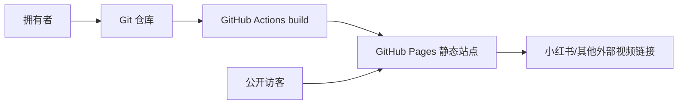

# 攀岩记录工具系统架构

**日期**: 2026-06-21
**状态**: accepted-for-mvp
**架构目标**: 不租服务器、不备案、不托管视频、尽量免费、静态发布、Git 管理数据。

## 结论

第一版采用 **Astro 或 Vite + React + TypeScript + 静态 JSON 数据 + GitHub Pages**。

推荐实现方式：

- **Vite + React + TypeScript**：交互式筛选、图表和移动端体验更直接。
- **Tailwind CSS**：快速做响应式界面。
- **Recharts 或 Tremor/轻量图表库**：做统计图。
- **Zod**：校验数据文件。
- **GitHub Pages + GitHub Actions**：免费静态托管和自动部署。
- **Git**：数据版本管理、回滚和审计。

不采用：

- Supabase / Firebase / CloudBase：第一版不需要数据库和登录，避免 SaaS 依赖、费用和境外网络不确定性。
- Vercel server functions / Next.js server runtime：不需要服务端逻辑。
- PocketBase / VPS：需要租服务器，不符合当前约束。
- 视频上传：大文件会带来存储、带宽、压缩、隐私和访问稳定性问题，第一版只记录外部链接。

## 平台边界



关键原则：

- 网站是纯静态文件：HTML、CSS、JS、JSON。
- 没有服务端数据库，没有登录态，没有服务器密钥。
- 所有公开记录来自仓库内的数据文件。
- 视频文件不进入仓库，页面只展示外部链接。
- GitHub Pages 上的内容是公开站点，不承载敏感信息。

## 官方依据和限制

- GitHub Pages 是静态站点托管，直接发布仓库里的 HTML/CSS/JavaScript，可用于个人网站：https://docs.github.com/en/pages/getting-started-with-github-pages/what-is-github-pages
- GitHub Pages 不支持 PHP、Ruby、Python 等服务端语言：https://docs.github.com/en/pages/getting-started-with-github-pages/creating-a-github-pages-site
- GitHub Pages 有软带宽限制、站点大小限制和仓库大小建议限制，不适合放很多视频大文件：https://docs.github.com/en/pages/getting-started-with-github-pages/github-pages-limits
- GitHub 普通仓库文件超过 50 MiB 会警告，超过 100 MiB 会阻止；因此不要把视频提交进仓库：https://docs.github.com/en/repositories/working-with-files/managing-large-files/about-large-files-on-github

## 中国内地访问和备案判断

此架构不使用中国大陆服务器，因此通常不走大陆云服务的 ICP 备案流程。若未来购买中国大陆服务器、使用大陆 CDN 或接入大陆云静态托管，则一般需要备案。

代价是：中国内地访问 GitHub Pages 不能保证稳定。它适合作为“低成本、无备案、无服务器”的个人主页方案，但不是“大陆访问强 SLA”方案。

如果未来必须保证中国内地访问稳定，现实选择通常是：

- 使用中国大陆云服务或 CDN，并完成 ICP 备案。
- 或使用香港/新加坡等境外托管，通常不备案，但内地访问仍没有强保证。

## 数据结构

建议使用单一数据文件：

```text
src/data/climbing-log.json
```

顶层结构：

```json
{
  "siteTitle": "攀岩记录",
  "gyms": [
    {
      "id": "gym-1",
      "name": "岩馆名称",
      "city": "城市",
      "color": "#2563eb"
    }
  ],
  "users": [
    {
      "id": "user-1",
      "name": "攀爬者昵称（支持中文）",
      "bio": "个人简介",
      "homeGym": "gym-1",
      "color": "#3b82f6"
    }
  ],
  "sessions": [
    {
      "id": "2026-06-21-gym-1",
      "climbedAt": "2026-06-21",
      "gymId": "gym-1",
      "userId": "user-1",
      "timeOfDay": "evening",
      "notes": "",
      "entries": [
        {
          "id": "entry-1",
          "discipline": "bouldering",
          "gradeLabel": "V3",
          "gradeRank": 30,
          "quantity": 1,
          "notes": "",
          "videoUrl": "https://www.xiaohongshu.com/...",
          "videoPlatform": "xiaohongshu",
          "videoTitle": "V3 动作记录"
        }
      ]
    }
  ]
}
```

## 字段规则

### siteTitle

- 全局网站标题，显示在顶部导航栏，所有攀爬者共用，不属于任何个人。

### Gym

- `id`: 稳定唯一 ID，不要用会变化的中文名作为引用。
- `name`: 岩馆展示名。
- `city`: 城市，可为空。
- `color`: UI 标签颜色，可为空。

### User

- `id`: 稳定唯一 ID，使用小写字母、数字和连字符；中文用户名会通过 slug 化 + 时间戳生成安全 id。**修改昵称不会改变 id**，因此所有引用该用户的记录会自动同步。
- `name`: 攀爬者昵称，支持中文，可随时修改。
- `bio`: 个人简介，可为空。每个攀爬者独立。
- `homeGym`: 常去岩馆 id（引用 `gyms[].id`），可为空。每个攀爬者独立。
- `color`: UI 标签颜色，可为空。

### Session

- `id`: 稳定唯一 ID，建议 `YYYY-MM-DD-short-name`。
- `climbedAt`: ISO 日期。
- `gymId`: 引用 `gyms[].id`。
- `userId`: 引用 `users[].id`，表示本场训练的攀爬者。
- `timeOfDay`: `morning`、`afternoon`、`evening`。
- `notes`: 公开备注，可为空。
- `entries`: 线路记录数组。

### Entry

- `id`: 线路记录唯一 ID。
- `discipline`: `bouldering` 或 `lead`。
- `gradeLabel`: 展示难度，如 `V2`、`V3`。
- `gradeRank`: 数字排序值，用于统计趋势。
- `quantity`: 线路数量，必须大于 0。
- `notes`: 备注，可为空。
- `videoUrl`: 外部视频链接，可为空。
- `videoPlatform`: `xiaohongshu`、`wechat`、`bilibili`、`douyin`、`other`，可为空。
- `videoTitle`: 视频标题，可为空。

## 应用结构

```text
src/
  data/
    climbing-log.json
  features/
    climbing/
      domain/
        types.ts
        grade.ts
        stats.ts
        validators.ts
      application/
        getPublicTimeline.ts
        getSessionDetail.ts
        getDashboardStats.ts
      adapters/
        staticDataRepository.ts
      components/
        SessionCard.tsx
        SessionDetail.tsx
        StatsPanel.tsx
        GradePill.tsx
        VideoLink.tsx
        GymFilter.tsx
  pages/
    HomePage.tsx
    SessionsPage.tsx
    SessionDetailPage.tsx
    StatsPage.tsx
  scripts/
    validate-data.ts
```

依赖方向：

- 页面和组件读取 application 层结果。
- application 层调用 staticDataRepository。
- domain 层只包含类型、校验、统计和业务规则。
- 不要把统计逻辑散落在 React 组件里。

## 页面结构

- `/`：个人主页，显示简介、核心统计、最近场次。
- `/sessions`：训练时间线，支持按攀爬者、岩馆、项目、难度筛选。
- `/sessions/:sessionId`：单场次详情，显示线路列表、数量、备注和外部视频入口。
- `/stats`：统计页，可按攀爬者筛选，显示月度趋势、难度分布、岩馆分布。

可选：

- `/editor`：本地辅助编辑器。管理攀爬者和岩馆，新增/编辑/删除训练记录，写入浏览器 localStorage，并提供"发布到 GitHub"按钮。

## 统计规则

- 总场次：`sessions.length`。
- 总线路数：`sum(entries.quantity)`。
- 完成线路数：`result in ["flash", "sent", "repeat"]` 的 `quantity` 之和。
- 完成率：完成线路数 / 总线路数。
- 最高完成难度：完成记录中最大的 `gradeRank`。
- 月度趋势：按 `climbedAt` 的月份聚合 `quantity`。
- 岩馆分布：按 session 的 `gymId` 聚合该场次 entries 的 `quantity`。
- 难度分布：按 `gradeLabel` 和 `gradeRank` 聚合 `quantity`。

## 视频策略

MVP 只支持外部视频链接。

UI 要求：

- 有 `videoUrl` 时显示清晰的外部打开按钮。
- 标明平台，如“小红书视频”。
- 不尝试 iframe 嵌入小红书，避免跨域、登录和平台限制导致体验不稳定。
- 不把视频文件、封面大图或压缩产物提交到仓库。

未来如果恢复视频上传，另开一阶段设计：

- 浏览器或本地侧压缩为 1080p H.264/AAC。
- 对象存储只存压缩后文件。
- 生成缩略图和时长 metadata。
- 设置存储配额和清理策略。

## 测试策略

- Unit tests：统计函数、难度排序、完成率、数据校验。
- Build tests：`npm run build` 必须能生成静态输出。
- Data validation：`npm run validate:data` 在 CI 中运行。
- E2E/smoke：检查 `/`、`/sessions`、`/stats`、一个详情页能打开。

## 部署

GitHub Pages 部署流程：

1. 初始化 Git 仓库。
2. 创建 Vite React 项目。
3. 配置 `vite.config.ts` 的 `base`，兼容 GitHub Pages 项目站点。
4. 添加 GitHub Actions workflow。
5. push 到 GitHub。
6. 在仓库设置中启用 Pages，选择 GitHub Actions 发布。

如果使用 `<username>.github.io` 仓库作为个人主页，站点路径可以是根路径。若使用普通项目仓库，站点路径通常是 `https://<username>.github.io/<repo>/`，需要正确设置 `base`。

## 后续扩展路径

- 本地编辑器导出 JSON。
- 从 CSV 导入。
- PWA 离线浏览。
- 数据导出。
- 视频托管和压缩。
- 迁移到数据库和后台登录。

